# 건강 one app ERD 설계

발표나 팀 공유에서는 [사람이 보기 쉬운 ERD](ERD_VISUAL.md)를 먼저 사용하세요. 이 문서는 구현자가 확인할 수 있는 전체 테이블/필드 기준 상세 ERD입니다.

## 설계 원칙

- 모든 기록은 `health_events`에 공통 이벤트로 저장합니다.
- 세부 데이터는 활동, 수면, 식사, 음용, 복용, 화장품 도메인 테이블로 분리합니다.
- 사진과 AI 분석은 `media_assets`와 `ai_analysis_results`로 공통화합니다.
- 외부 Health API 데이터는 `data_sources`와 `external_record_id`로 출처와 중복 방지를 관리합니다.

## ERD

```mermaid
erDiagram
    users ||--|| user_profiles : has
    users ||--o{ health_events : owns
    users ||--o{ data_sources : authorizes
    users ||--o{ media_assets : uploads
    users ||--o{ reminder_rules : configures
    users ||--o{ notification_logs : receives

    data_sources ||--o{ health_events : provides
    health_events ||--o| activity_records : details
    health_events ||--o| sleep_records : details
    health_events ||--o| meal_logs : details
    health_events ||--o| beverage_logs : details
    health_events ||--o| intake_logs : details
    health_events ||--o| cosmetic_usage_logs : details
    health_events ||--o{ media_assets : evidence
    health_events ||--o{ ai_analysis_results : analyzed_by

    meal_logs ||--o{ food_items : contains
    medication_items ||--o{ intake_logs : medication
    supplement_items ||--o{ intake_logs : supplement
    interaction_checks ||--o{ interaction_check_items : checks
    medication_items ||--o{ interaction_check_items : medication
    supplement_items ||--o{ interaction_check_items : supplement
    cosmetic_products ||--o{ cosmetic_ingredients : includes
    cosmetic_products ||--o{ cosmetic_usage_logs : used_as
    reminder_rules ||--o{ notification_logs : emits

    users {
        uuid id PK
        text email UK
        text password_hash
        text display_name
        timestamptz created_at
        timestamptz updated_at
    }

    user_profiles {
        uuid user_id PK,FK
        date birth_date
        text sex
        numeric height_cm
        numeric weight_kg
        text activity_goal
        text timezone
        jsonb allergies
        jsonb health_notes
    }

    data_sources {
        uuid id PK
        uuid user_id FK
        text source_type
        text display_name
        text external_account_id
        timestamptz authorized_at
        timestamptz revoked_at
    }

    health_events {
        uuid id PK
        uuid user_id FK
        text event_type
        uuid source_id FK
        text external_record_id
        timestamptz started_at
        timestamptz ended_at
        text timezone
        numeric confidence_score
        jsonb raw_payload
        timestamptz created_at
    }

    media_assets {
        uuid id PK
        uuid user_id FK
        uuid health_event_id FK
        text media_type
        text purpose
        text storage_url
        text content_hash
        timestamptz created_at
    }

    ai_analysis_results {
        uuid id PK
        uuid health_event_id FK
        uuid media_asset_id FK
        text analysis_type
        text model_name
        numeric confidence_score
        jsonb result_payload
        text safety_notice
        timestamptz created_at
    }

    reminder_rules {
        uuid id PK
        uuid user_id FK
        text target_type
        uuid target_id
        text title
        text rrule
        boolean is_active
        timestamptz created_at
    }

    notification_logs {
        uuid id PK
        uuid user_id FK
        uuid reminder_rule_id FK
        timestamptz scheduled_at
        timestamptz sent_at
        text status
    }

    activity_records {
        uuid health_event_id PK,FK
        integer steps
        integer active_minutes
        numeric active_kcal
        text workout_type
        numeric distance_meters
    }

    sleep_records {
        uuid health_event_id PK,FK
        integer total_minutes
        integer awake_minutes
        integer deep_sleep_minutes
        integer rem_sleep_minutes
        numeric sleep_score
        text quality_note
    }

    meal_logs {
        uuid health_event_id PK,FK
        text meal_type
        numeric total_kcal
        numeric carbs_g
        numeric protein_g
        numeric fat_g
        text analysis_status
    }

    food_items {
        uuid id PK
        uuid meal_log_id FK
        text name
        numeric serving_amount
        text serving_unit
        numeric kcal
        numeric carbs_g
        numeric protein_g
        numeric fat_g
        numeric confidence_score
    }

    beverage_logs {
        uuid health_event_id PK,FK
        text beverage_type
        text name
        numeric volume_ml
        numeric kcal
        numeric sugar_g
        numeric caffeine_mg
        text analysis_status
    }

    medication_items {
        uuid id PK
        uuid user_id FK
        text name
        text ingredient_name
        text dose_amount
        text instructions
    }

    supplement_items {
        uuid id PK
        uuid user_id FK
        text name
        text ingredient_name
        text dose_amount
        text instructions
    }

    intake_logs {
        uuid health_event_id PK,FK
        uuid medication_item_id FK
        uuid supplement_item_id FK
        timestamptz taken_at
        text status
        text note
    }

    interaction_checks {
        uuid id PK
        uuid user_id FK
        text risk_level
        text summary
        text recommendation
        jsonb evidence_payload
        timestamptz created_at
    }

    interaction_check_items {
        uuid id PK
        uuid interaction_check_id FK
        uuid medication_item_id FK
        uuid supplement_item_id FK
        text item_type
    }

    cosmetic_products {
        uuid id PK
        uuid user_id FK
        text name
        text brand
        text product_type
        text skin_type_target
        timestamptz created_at
    }

    cosmetic_ingredients {
        uuid id PK
        uuid cosmetic_product_id FK
        text ingredient_name
        text safety_level
        text effect_summary
        text caution_summary
    }

    cosmetic_usage_logs {
        uuid health_event_id PK,FK
        uuid cosmetic_product_id FK
        text body_area
        text reaction_note
    }
```



## 주요 제약

- `data_sources.source_type`은 `manual`, `vision_ai`, `label_scan`, `apple_health`, `samsung_health`, `wearable` 중 하나입니다.
- `health_events.event_type`은 `activity`, `sleep`, `meal`, `beverage`, `intake`, `cosmetic_usage`, `health_sync` 중 하나입니다.
- `health_events`는 `source_id + external_record_id` 조합으로 외부 데이터 중복 업로드를 막습니다.
- `confidence_score`는 0 이상 1 이하로 저장합니다.
- `intake_logs`는 약 또는 영양제 중 최소 하나를 참조해야 합니다.

---

## 레인별 테이블 구획

> `db/schema.sql`과 동일한 구획 기준. 해당 레인만 자기 구획을 편집.

<!-- [FROZEN] ENUMS & CORE (L1 only) -->
### [FROZEN] ENUMS & CORE — L1 담당 (수정 금지)

| 테이블 / 타입 | 설명 |
|---|---|
| `data_source_type` (enum) | manual, vision_ai, label_scan, apple_health, samsung_health, wearable |
| `health_event_type` (enum) | activity, sleep, meal, beverage, intake, cosmetic_usage, health_sync |
| `interaction_risk_level` (enum) | low, medium, high, unknown |
| `users` | 계정 |
| `user_profiles` | 건강 프로필 |
| `data_sources` | 데이터 출처 등록 |
| `health_events` | 통합 이벤트 허브 (+ dedup 인덱스) |
| `media_assets` | 사진·라벨 파일 참조 |
| `ai_analysis_results` | AI 분석 결과 |

<!-- [L2] ACTIVITY / SLEEP / NUTRITION -->
### [L2] ACTIVITY / SLEEP / NUTRITION — L2 담당

| 테이블 | 설명 |
|---|---|
| `activity_records` | 활동 세부 (steps, active_minutes 등) |
| `sleep_records` | 수면 세부 (total_minutes, sleep_score 등) |
| `meal_logs` | 식사 요약 (total_kcal, 매크로) |
| `food_items` | 식사별 음식 항목 |
| `beverage_logs` | 음용 기록 (volume_ml, caffeine_mg 등) |

<!-- [L3] MEDS / INTERACTION / COSMETICS -->
### [L3] MEDS / INTERACTION / COSMETICS — L3 담당

| 테이블 | 설명 |
|---|---|
| `medication_items` | 약 카탈로그 |
| `supplement_items` | 영양제 카탈로그 |
| `intake_logs` | 복용 기록 |
| `interaction_checks` | 상호작용 분석 결과 |
| `interaction_check_items` | 분석 대상 항목 |
| `cosmetic_products` | 화장품 카탈로그 |
| `cosmetic_ingredients` | 화장품 성분 |
| `cosmetic_usage_logs` | 화장품 사용 기록 |

<!-- [L4] REMINDERS / REPORTS -->
### [L4] REMINDERS / REPORTS — L4 담당

| 테이블 | 설명 |
|---|---|
| `reminder_rules` | 사용자 정의 반복 알림 규칙 (iCalendar RRULE) |
| `notification_logs` | 알림 발송 이력 (scheduled_at, sent_at, status) |

**L4 추가 제약**

- `reminder_rules.target_type`: `CHECK (target_type IN ('intake', 'hydration', 'sleep', 'activity', 'custom'))`
- `notification_logs.status`: `CHECK (status IN ('scheduled', 'sent', 'failed'))`

**L4 인덱스**

- `reminder_rules_user_active_idx` ON `reminder_rules(user_id, is_active)` — 사용자 규칙 목록 필터링
- `notification_logs_user_scheduled_idx` ON `notification_logs(user_id, scheduled_at DESC)` — 이력 시간순 조회
- `notification_logs_rule_idx` ON `notification_logs(reminder_rule_id)` — FK 역방향 조회

**집계 엔드포인트 의존성** (`/reports/*`)

리포트는 모든 레인 데이터를 집계합니다. 필드명 최종 확정은 L1~L3 동결 후 진행:

```
/reports/daily  → health_events + activity_records, sleep_records,
                  meal_logs, beverage_logs, intake_logs, notification_logs
/reports/weekly → 위와 동일, 7일 집계
```

상세 스키마 및 응답 예시는 [docs/api/l4.md](api/l4.md) 참조.
