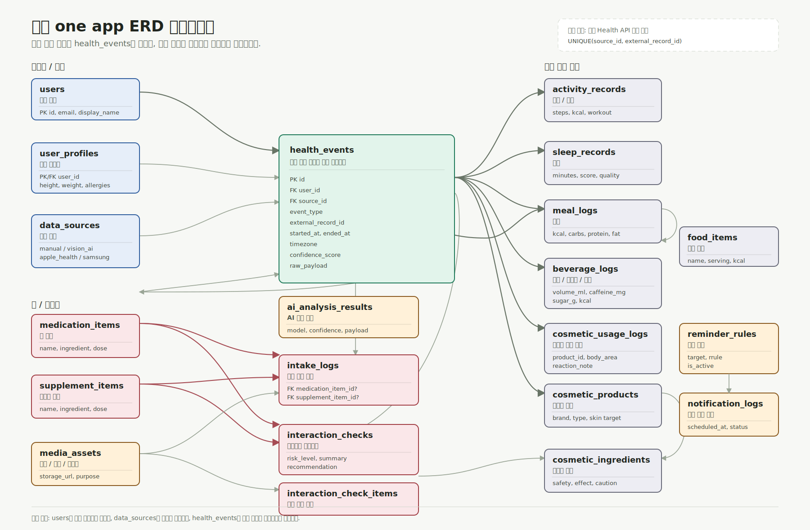
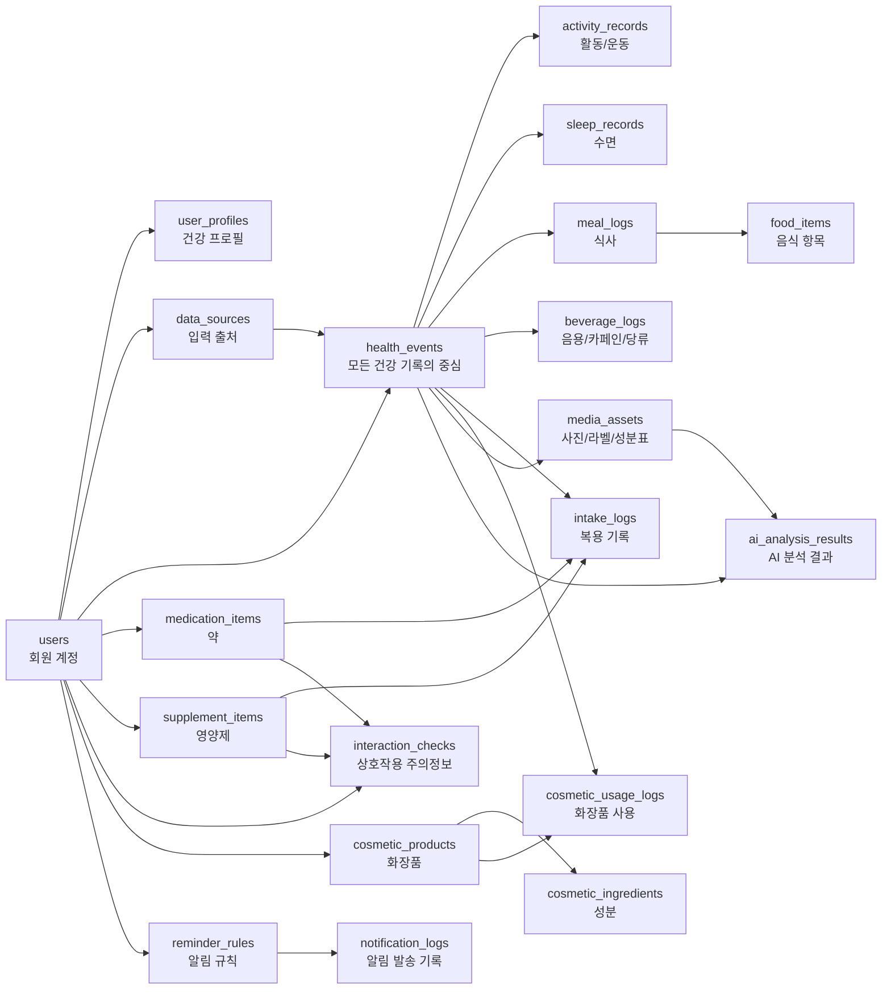
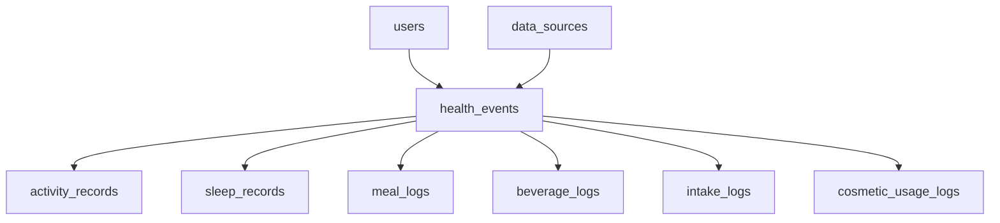
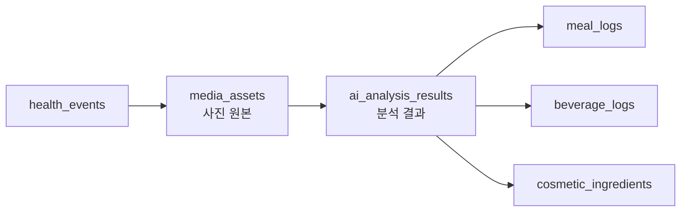
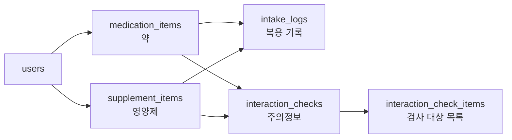
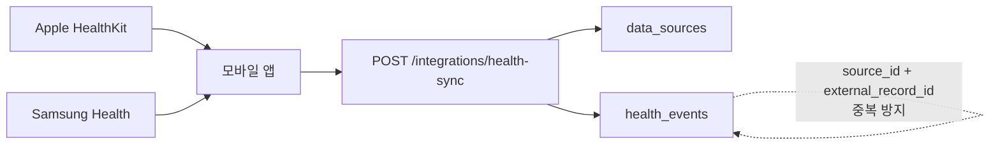

# 건강 one app ERD - 발표용 가시화

이 문서는 팀 세션에서 설명하기 쉽게 만든 요약 ERD입니다. 전체 컬럼까지 확인해야 할 때는 [상세 ERD](ERD.md)와 [DB 스키마](../db/schema.sql)를 보면 됩니다.

브라우저에서 크게 보고 싶으면 [ERD_VISUAL.html](ERD_VISUAL.html)을 여세요. 발표 자료에 바로 넣을 그림 파일은 [ERD_DIAGRAM.svg](ERD_DIAGRAM.svg)를 사용하면 됩니다.

## 발표용 ERD 다이어그램



## 한눈에 보는 구조



## 핵심만 말하면

| 구역 | 테이블 | 역할 |
| --- | --- | --- |
| 사용자 | `users`, `user_profiles` | 계정과 건강 기본 정보 |
| 입력 출처 | `data_sources` | 직접 입력, 사진 분석, Apple/Samsung Health 같은 데이터 출처 |
| 중심 이벤트 | `health_events` | 활동, 식사, 음용, 수면, 복용, 화장품 사용을 같은 시간축에 저장 |
| 사진/AI | `media_assets`, `ai_analysis_results` | 식사 사진, 음료 라벨, 성분표와 분석 결과 저장 |
| 활동/수면 | `activity_records`, `sleep_records` | 걸음 수, 운동, 수면 시간과 품질 |
| 식사/음용 | `meal_logs`, `food_items`, `beverage_logs` | 음식별 영양 정보, 카페인, 당류, 수분 |
| 복용/주의정보 | `medication_items`, `supplement_items`, `intake_logs`, `interaction_checks` | 약/영양제 등록, 복용 기록, 상호작용 주의 정보 |
| 화장품 | `cosmetic_products`, `cosmetic_ingredients`, `cosmetic_usage_logs` | 제품, 성분, 사용 반응 |
| 알림 | `reminder_rules`, `notification_logs` | 복용/수분/생활 알림과 발송 이력 |

## 도메인별 상세 그림

### 1. 모든 기록은 health_events로 모인다



`health_events`가 중심인 이유는 하루 리포트에서 "오늘 먹은 것, 마신 것, 잔 것, 움직인 것, 바른 것, 복용한 것"을 날짜 기준으로 한 번에 묶기 위해서입니다.

### 2. 사진 분석은 공통 구조를 쓴다



식사 사진, 음료 라벨, 화장품 성분표는 모두 `media_assets`에 저장하고 분석 결과를 `ai_analysis_results`에 남깁니다.

### 3. 약/영양제는 기록과 주의정보를 분리한다



`intake_logs`는 실제로 언제 먹었는지 저장하고, `interaction_checks`는 조합의 주의정보를 따로 저장합니다. 이 기능은 진단이 아니라 건강 관리용 주의정보입니다.

### 4. 외부 Health API는 중복 방지가 핵심이다



HealthKit/Samsung Health 원본 데이터는 모바일 앱이 사용자 동의 후 읽고 서버로 업로드합니다. 같은 외부 기록이 두 번 들어와도 `source_id + external_record_id`로 중복 생성을 막습니다.

## 발표용 설명 문장

```text
건강 one app의 DB는 health_events를 중심으로 설계했습니다.
모든 건강 기록을 같은 시간축에 넣고, 식사/음용/수면/복용/화장품 같은 세부 정보만 별도 테이블로 나눕니다.
그래서 일간 리포트나 AI 분석에서 사용자의 하루 건강 요인을 한 번에 합쳐 볼 수 있습니다.
```
